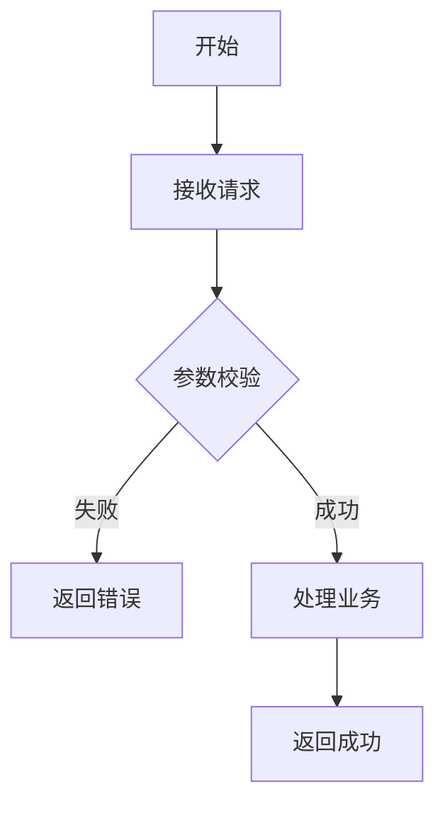
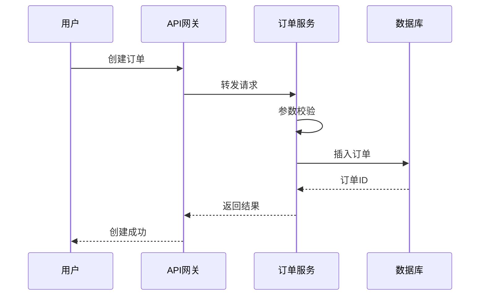
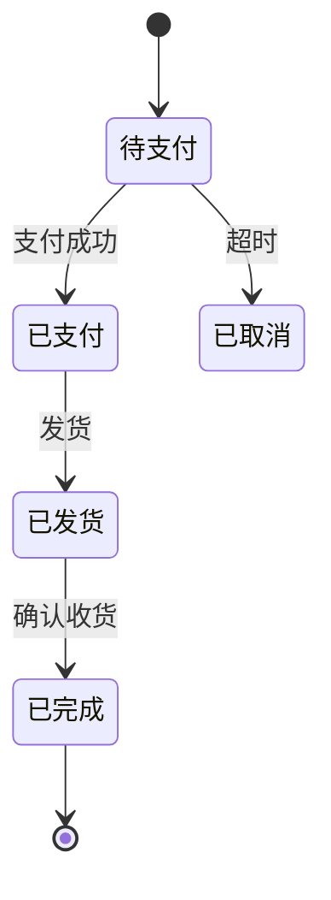
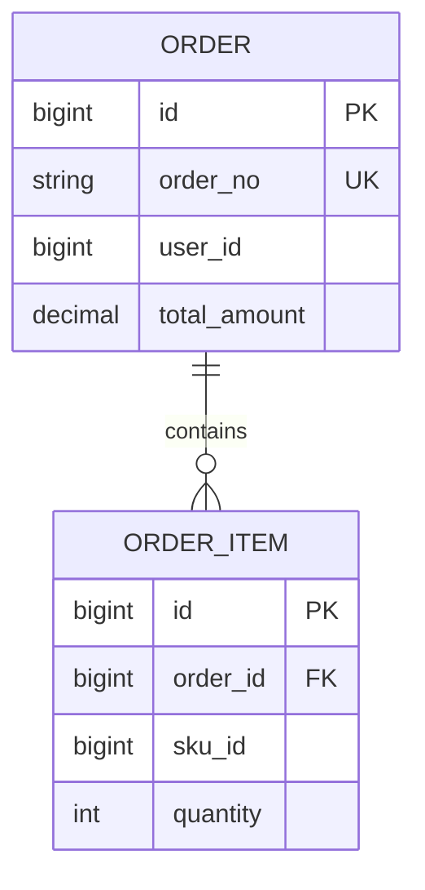
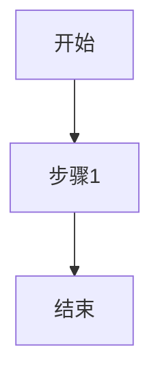
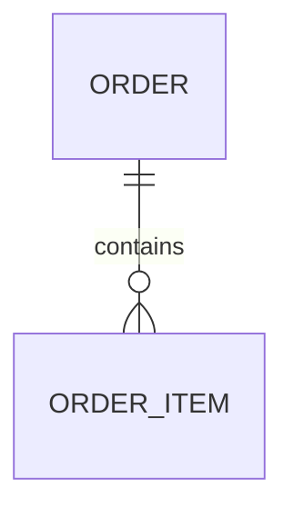
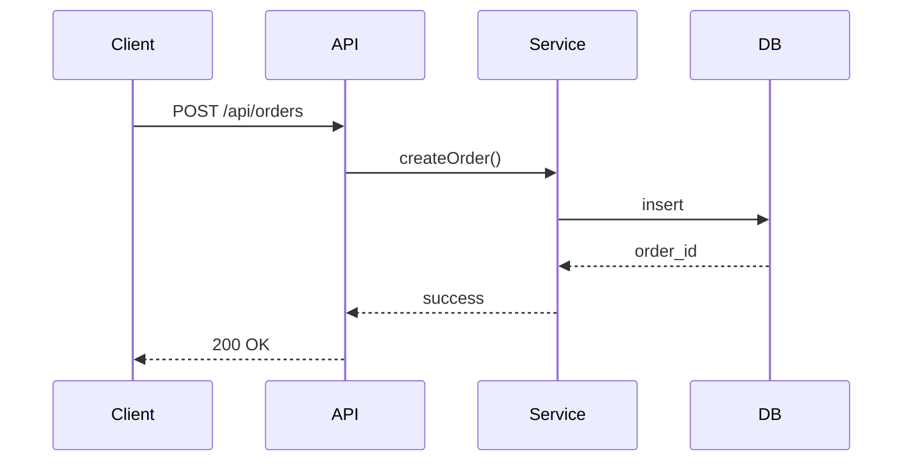

# 详细设计文档技能

## 文档结构（6 项）

1. **背景介绍** - 必须输出（问题、价值、目标）
2. **需求描述** - 留空
3. **技术架构** - 留空
4. **业务流程** - 必须输出（使用 Mermaid 图表）
5. **模型设计** - 按需输出（有数据表时）
6. **接口设计** - 按需输出（有对外接口时）

## Mermaid 图表语法

### 1. 流程图


**常用符号**：
- `[文本]` - 矩形
- `{文本}` - 菱形（判断）
- `-->` - 箭头
- `-->|文本|` - 带标签箭头

### 2. 时序图


**常用语法**：
- `participant A as 名称` - 定义参与者
- `A->>B: 消息` - 请求（实线）
- `B-->>A: 消息` - 响应（虚线）

### 3. 状态图


### 4. ER 图


**关系符号**：
- `||--o{` - 一对多
- `||--||` - 一对一
- `}o--o{` - 多对多

## 文档模板

```markdown
# [功能名称]详细设计文档

## 1. 背景介绍

### 当前问题
[描述存在的问题]

### 业务价值
[说明解决问题的价值]

### 改进目标
- 目标 1
- 目标 2

## 2. 需求描述
（留空）

## 3. 技术架构
（留空）

## 4. 业务流程

### 整体流程


### 流程说明
[关键步骤的文字说明]

## 5. 模型设计
（如无数据表，留空）

### 数据表结构

#### order（订单表）
| 字段名 | 类型 | 长度 | 必填 | 说明 | 索引 |
|-------|------|------|------|------|------|
| id | BIGINT | - | 是 | 主键 | PK |
| order_no | VARCHAR | 32 | 是 | 订单号 | UK |
| user_id | BIGINT | - | 是 | 用户ID | IDX |
| status | VARCHAR | 20 | 是 | 状态 | - |
| total_amount | DECIMAL | 10,2 | 是 | 总金额 | - |
| create_time | DATETIME | - | 是 | 创建时间 | - |

**索引**：
- PRIMARY KEY: `id`
- UNIQUE KEY: `uk_order_no` (`order_no`)
- INDEX: `idx_user_id` (`user_id`)

### ER 图


## 6. 接口设计
（如无对外接口，留空）

### 创建订单
**路径**：`POST /api/orders`

**请求参数**：
| 参数 | 类型 | 必填 | 说明 |
|-----|------|------|------|
| orderNo | String | 是 | 订单号 |
| userId | Long | 是 | 用户ID |
| items | Array | 是 | 订单明细 |

**请求示例**：
```json
{
  "orderNo": "ORD202602020001",
  "userId": 12345,
  "items": [
    {"skuId": 1001, "quantity": 2, "price": 99.99}
  ]
}
```

**返回结果**：
```json
{
  "code": 200,
  "message": "success",
  "data": 67890
}
```

**异常码**：
| 错误码 | 说明 |
|-------|------|
| 400 | 参数错误 |
| 1001 | 库存不足 |
| 500 | 系统异常 |

### 时序图

```

## 编写要点

### 背景介绍
- 说清楚"为什么做"
- 突出业务价值
- 明确目标

### 业务流程
- **必须用图表**（流程图/时序图/状态图）
- 图表清晰，关键步骤有说明
- 考虑异常流程

### 模型设计
- **按需输出**：有数据表才写
- 包含：表结构、索引、ER 图

### 接口设计
- **按需输出**：有对外接口才写
- 包含：路径、参数、返回、异常、时序图

## 检查清单

- [ ] 背景介绍完整
- [ ] 业务流程有图表
- [ ] Mermaid 语法正确
- [ ] 模型设计完整（如有）
- [ ] 接口设计完整（如有）
- [ ] 表结构有索引
- [ ] 接口有示例和异常码

## 图表速查

| 图表 | 关键字 | 用途 |
|-----|--------|------|
| 流程图 | `flowchart TD` | 业务步骤 |
| 时序图 | `sequenceDiagram` | 系统交互 |
| 状态图 | `stateDiagram-v2` | 状态流转 |
| ER 图 | `erDiagram` | 表关系 |
