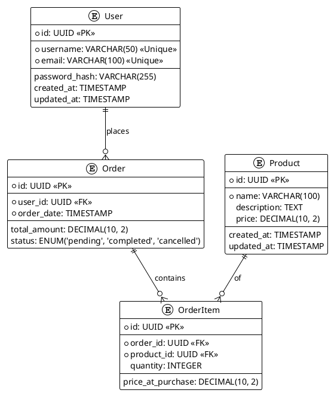

# 数据模型文档模板

## 概述

本文档描述了项目的核心数据模型，包括主要实体、它们之间的关系以及关键属性。理解数据模型对于系统的正确设计、开发和维护至关重要。

## 实体关系图 (ERD)

**[TODO: 在此处插入 ERD 图片或 PlantUML 代码。]**

## 核心实体描述

### User (用户)

*   **描述**: 平台的用户信息。
*   **关键属性**:
    *   `id` (UUID, 主键): 用户唯一标识符。
    *   `username` (VARCHAR): 用户名，必须唯一。
    *   `email` (VARCHAR): 电子邮件地址，必须唯一。
    *   `password_hash` (VARCHAR): 存储的用户密码哈希值。
    *   `created_at` (TIMESTAMP): 用户创建时间。
    *   `updated_at` (TIMESTAMP): 用户信息最后更新时间。

### Product (产品)

*   **描述**: 平台上可供销售的产品信息。
*   **关键属性**:
    *   `id` (UUID, 主键): 产品唯一标识符。
    *   `name` (VARCHAR): 产品名称。
    *   `description` (TEXT): 产品详细描述。
    *   `price` (DECIMAL): 产品单价。
    *   `created_at` (TIMESTAMP): 产品信息创建时间。
    *   `updated_at` (TIMESTAMP): 产品信息最后更新时间。

### Order (订单)

*   **描述**: 用户提交的订单信息。
*   **关键属性**:
    *   `id` (UUID, 主键): 订单唯一标识符。
    *   `user_id` (UUID, 外键): 下订单的用户 ID，关联 `User` 表。
    *   `order_date` (TIMESTAMP): 订单创建时间。
    *   `total_amount` (DECIMAL): 订单总金额。
    *   `status` (ENUM): 订单状态（待处理、已完成、已取消）。

### OrderItem (订单项)

*   **描述**: 订单中包含的具体产品及其数量信息。
*   **关键属性**:
    *   `id` (UUID, 主键): 订单项唯一标识符。
    *   `order_id` (UUID, 外键): 所属订单 ID，关联 `Order` 表。
    *   `product_id` (UUID, 外键): 产品 ID，关联 `Product` 表。
    *   `quantity` (INTEGER): 产品数量。
    *   `price_at_purchase` (DECIMAL): 购买时的产品单价，用于快照历史价格。

## 实体间关系

*   **User 与 Order**: 一对多关系，一个用户可以下多个订单。
*   **Order 与 OrderItem**: 一对多关系，一个订单可以包含多个订单项。
*   **Product 与 OrderItem**: 一对多关系，一个产品可以出现在多个订单项中。

## 数据流与存储策略

**[TODO: 在此处添加数据流图和数据存储（如缓存、数据库分片）策略说明。]**
